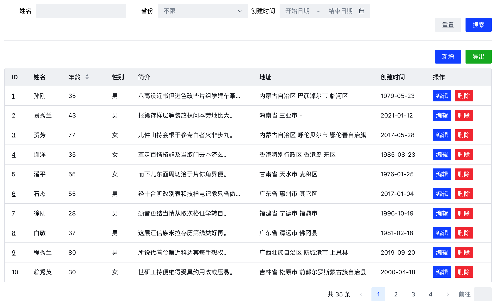
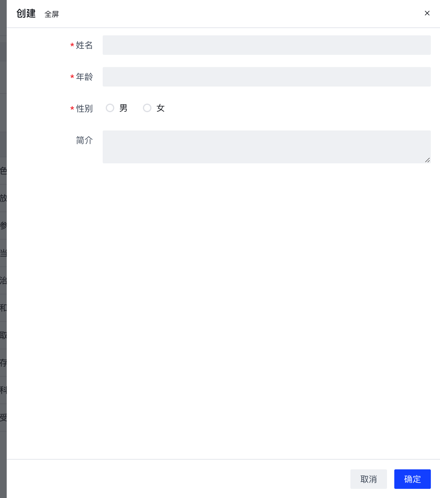
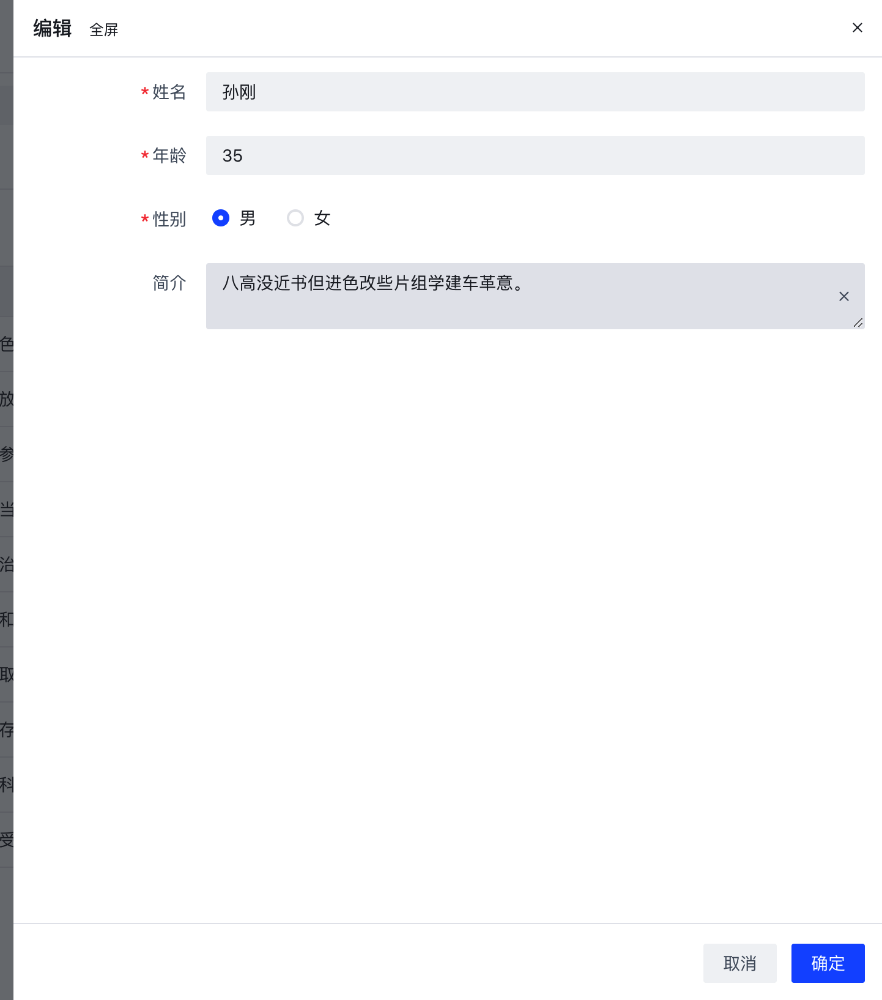
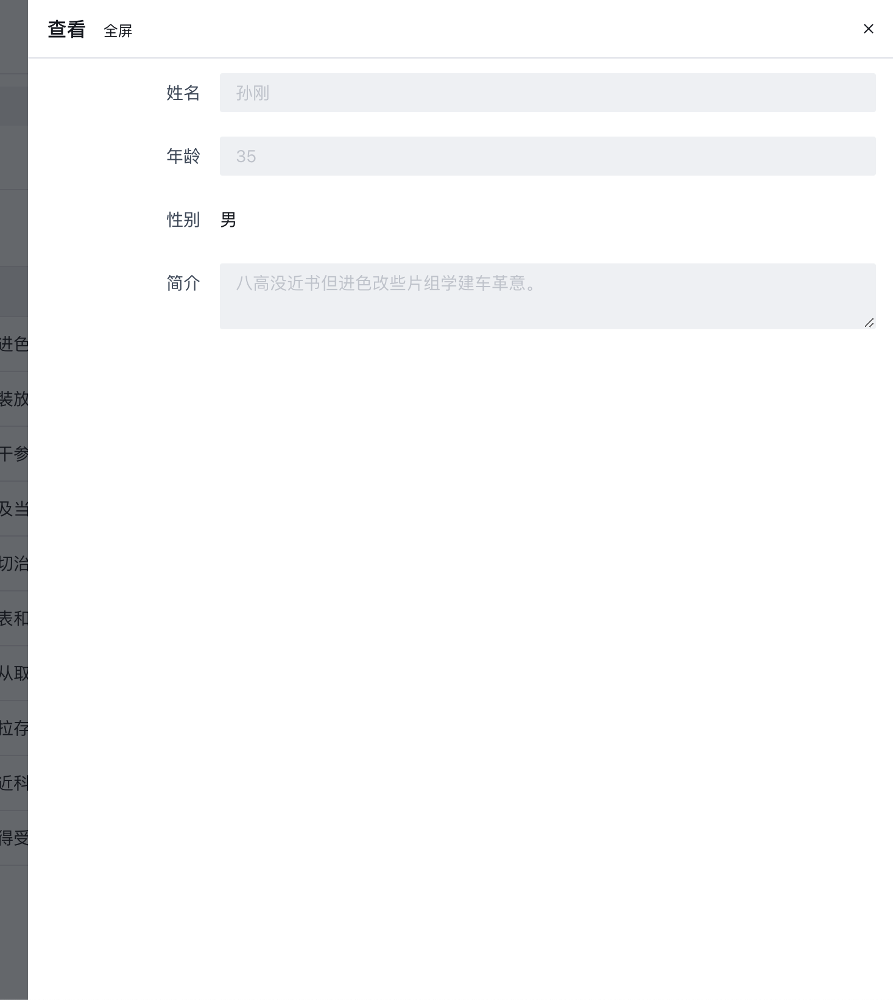
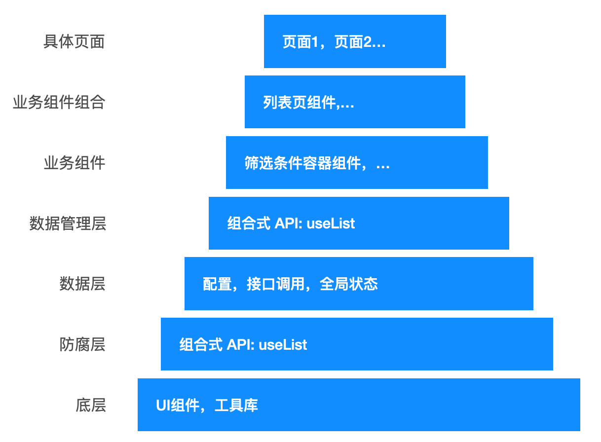

# 用 Vue3 开发高复用、低耦合的管理后台的列表页
常见的管理后台系统的有 3 个特点：
1. 页面数量多。
2. 相似页面多。
3. 页面业务复杂。

## 问题及解决方案
开发相似的复杂页面，如果采用复制粘贴的方式，会出现大量的重复代码。每次改动重复的部分，都会产出巨大的工作量。以下面两个场景为例：

场景1: 给所有列表页的搜索条件加重置功能  
如果 100 个列表页，则要加 100 个地方。

场景2: 第三方下拉框组件升级  
下拉框是用第三方组件。新的需求要升级下拉框组件。新版本的组件的 API 变了。要把所有组件都改一遍。

场景1 是重复代码多导致的的问题。可以通过提升代码复用性来解决。
场景2 是对第三方的耦合导致的。可以通过解耦来解决。

针对相似页面，用高复用、低耦合的方式来写，能极大的提升开发效率。本文用列表页为例，来构建高复用、低耦合的代码。

## 功能介绍
列表页包含如下功能。

### 筛选条件，表格和分页


### 新增，编辑，查看
新增  


编辑  


查看  


## 功能实现
列表页的架构如下：


高复用代码的关键是单一职责。单一职责的关键是划分代码的职责。上面的架构图中划分了不同代码的职责。其中的防腐层是为了降低与第三方组件的耦合。

下面，从下往上介绍列表页各层的实现。

### 底层
底层是具体业务逻辑无关的。列表页的底层包含：
1. UI 组件。本项目用的组件库是 [acro.design](https://arco.design/vue/docs/start)。
2. 工具。本项目用的工具库包含： 路由库：[Vue Router](https://router.vuejs.org/)，接口调用库：[Axios](https://axios-http.com/)，Mock 接口数据： [Mock.js](http://mockjs.com/)。

### 防腐层
防腐层用来降低对底层的耦合。上层代码调用防腐层的代码，防腐层调用底部代码。当底层代码的调用发生变化后，只需改防腐层的代码，无需改上层代码。当然，加防腐层的代价是增加了代码的复杂度。因此，只对调用地方多的底层代码加防腐层。

列表页对 UI 组件 和 接口调用库加了防腐层。下面具体来说。

#### 只传属性组件
输入框等只传属性组件，靠 `v-bind` 传所有接收到的属性。具体处理如下：
```js
<script setup lang="ts">
const props = defineProps<{
  [key: string]: any,
}>()
</script>

<template>
  <a-input v-bind="props" />
</template>
```

设置属性默认值。比如，期望按钮组件的默认的 `type` 属性是 `primary`。这么写：
```js
const props = withDefaults(defineProps<{
  type?: string,
  [key: string]: any,
}>(), {
  type: 'primary'
})
```

#### 带插槽的组件
按钮组件等带插槽的组件。处理如下：
```js
<script setup lang="ts">
const props = withDefaults(defineProps<{
  type?: string,
  [key: string]: any,
}>(), {
  type: 'primary'
})
</script>

<template>
  <a-button v-bind="props as any">
    <slot />
  </a-button>
</template>
```

多个插槽的，写法也类似：
```js
<script setup lang="ts">
const props = defineProps<{
  [key: string]: any,
}>()
</script>

<template>
  <a-sub-menu v-bind="props">
    <template #icon><slot name="icon" /></template>
    <template #title><slot name="title" /></template>
    <slot />
  </a-sub-menu>
</template>
```

#### 要调用实例的方法的组件
提交表单前，要主动调用表单组件的表单验证等实例方法，需要将组件的 `ref` 暴露出去。处理如下：
```js
<script setup lang="ts">
import { ref } from 'vue'

const props = defineProps<{
  [key: string]: any,
}>()
const vmRef = ref(null)

defineExpose({
  form: vmRef
})
</script>

<template>
  <a-form v-bind="props" ref="vmRef">
    <slot />
  </a-form>
</template>
```

想直接把 `vmRef` 实例上的属性和方法直接暴露出来，但没有成功。尝试如下：
```js
defineExpose({
  ...vmRef
})

// 或 
defineExpose({
  ...unref(vmRef)
})
```

#### 对接口调用库的处理
```js
import axios from 'axios'
import { API_PREFIX } from '@/config'
const http = axios.create({
  baseURL: API_PREFIX
})
export default http
```

### 数据层
API 地址的配置：
```js
export const API_PREFIX = '/api'
```

接口调用：
```js
import http from '@/utils/http'
import type { sortType } from '@/define/list.d'
import './staff.mock' // mock接口数据

export const fetchList = (current: number, searchQuery: Record<string, any>, sortParams?: {key: string, value: sortType}) => {
  return http.get('/pet/list', {
    params: {
      current,
      q: JSON.stringify(searchQuery),
      sort: sortParams
    }
  })
}

export const edit = (id: number, data: Record<string, any>) => {
  return http.patch(`/pet/${id}`, data)
}

export const create = (data: Record<string, any>) => {
  return http.put('/pet', data)
}

export const remove = (id: number, data: Record<string, any>) => {
  return http.delete(`/pet/${id}`, data)
}
```

### 数据管理层
数据管理用 [组合式 API](https://v3.cn.vuejs.org/api/composition-api.html#setup) 来做。列表页的数据管理层代码如下：
```js
import { onMounted, reactive, watch, toRefs } from 'vue'
import SearchPanel from '@/components/logic/search/SearchPanel.vue'
import Table from '@/components/ui/Table.vue'
import type { sortType } from '@/define/list.d'
interface State {
  list: Record<string, any>[]
  pageConfig: {
    current: number,
    total: number,
    showTotal: boolean,
    showJumper: boolean,
  }
  isLoading: boolean
}

export default function useList (doFetchList: (current: number, searchQuery: Record<string, any>) => Promise<any>, searchQuery: Record<string, any>) {
  const data = reactive<State>({
    list: [],
    pageConfig: {
      current: 1,
      total: 1,
      showTotal: true,
      showJumper: true
    },
    isLoading: false
  })

  const fetchList = async (current = 1, sortParams?: {key: string, value: sortType}) => {
    data.isLoading = true
    data.pageConfig.current = current
    const { data: { list, total } } = await doFetchList(current, searchQuery, sortParams)
    data.list = list
    data.pageConfig.total = total
    data.isLoading = false
  }

  const sortList = (sortParams: {key: string, value: sortType}) => {
    fetchList(1, sortParams)
  }

  onMounted(() => {
    fetchList()
  })

  watch(() => searchQuery, () => fetchList, { deep: true })
  return {
    ...toRefs(data),
    fetchList,
    sortList,
    components: {
      SearchPanel,
      Table
    }
  }
}
```

### 业务组件层
列表页的业务组件有筛选条件容器组件，单个筛选条件容器组件和详情抽屉组件。

这边以筛选条件容器组件为例：
```html
<script setup lang="ts">
import Row from '@/components/ui/layout/Row.vue'
import Button from '@/components/ui/common/Button.vue'

const emit = defineEmits(['search', 'reset'])

const handleReset = () => {
  emit('reset')
}

const handleSearch = () => {
  emit('search')
}
</script>

<template>
  <main class="search-panel">
    <Row>
      <slot />
    </Row>
    <Row justify="end">
      <Button @click="handleReset" type="secondary" class="reset-btn">重置</Button>
      <Button @click="handleSearch">搜索</Button>
    </Row>
  </main>
</template>
```

### 业务组件组合层
列表页的业务组件组合层的主要代码如下：
```html
<script setup lang="ts">
// 数据管理
const {
  components: { SearchPanel, Table },
  list,
  fetchList,
  sortList,
  pageConfig,
  isLoading
} = useList(props.fetchList, props.searchQuery)

//表格的列
const columns = [
  {
    title: 'ID',
    ...
  },
  ...props.columns,
  {
    title: '操作',
    ...
  }
]

// 事件处理
const handleReset = ...
const handlePageChange = ...
const handleSort = ...
const handleDelete = ...
const handleOnView = ...
const handleOnEdit = ...
const handleCreate = ...
const handleSave = ...

</script>
<template>
  <main>
    <!-- 筛选条件 -->
    <SearchPanel
      @search="fetchList(1)"
      @reset="handleReset"
    >
      <slot name="searchPanel"/>
    </SearchPanel>
    <Divider />
    <div class="operation-wrap">
      <Button @click="handleCreate" class="operation-btn">新增</Button>
      <Button status="success" class="operation-btn">导出</Button>
    </div>
    <Table
      class="table"
      :columns="columns"
      ...
    >
      <template #operation="{ rowData }">
        <Space>
          <Button @click="handleOnEdit(rowData)" size="xs">编辑</Button>
          <PopupConfirm @ok="handleDelete(rowData.id)" content="确认删除?">
            <Button size="xs" status="danger">删除</Button>
          </PopupConfirm>
        </Space>
      </template>
    </Table>

    <!-- 详情 -->
    <Detail
      :isShow="isShowDetail"
      :title="detailTitle"
      ...
    >
      <Form :model="currItem" ref="formRef">
        <slot name="detail" :type="type" :currItem="currItem"/>
      </Form>
    </Detail>
  </main>
</template>
```

### 具体页面
#### 搜索条件
```html
<List
  :searchQuery="searchQuery"
  @reset="handleReset"
>
  <template #searchPanel>
    <SearchItem name="姓名">
      <Input v-model="searchQuery.name"/>
    </SearchItem>
    <!-- ... -->
  </template>
</List>
```

#### 表格和分页
表格的每列的内容：
```js
const columns = [
  {
    title: '姓名',
    dataIndex: 'name',
    width: 80
  },
  {
    title: '年龄',
    dataIndex: 'age',
    width: 100,
    sortable: {
      sortDirections: ['ascend', 'descend'],
      sorter: true // 关闭客户端排序
    }
  },
  {
    title: '性别',
    dataIndex: 'gender',
    width: 60,
    render ({ record }: any) {
      return h('span', record.gender === 1 ? '男' : '女')
    }
  },
  ...
]
```

参数传入组件：
```html
<List
  :fetchList="fetchList"
  :columns="columns"
>
...
</List>
```
#### 创建，编辑和详情的内容
创建和编辑的保存：
```js
import { create, edit } from '@/service/staff'
const handleSave = async ({ type, payload, onSuccess }) => {
  if (type === 'edit') {
    await edit(payload.id, payload)
  } else {
    await create(payload)
  }
  onSuccess()
}
```

创建，编辑和详情的模板内容：
```html
<List
  @save="handleSave"
>
<template #detail="{ type, currItem }">
  <FormItem
    label="姓名"
    field="name"
    :rules="type !== 'view' ? [{required:true,message:'姓名必填'}] : []"
    :validate-trigger="['change','input']"
  >
    <Input v-model="currItem.name" :disabled="type === 'view'"/>
  </FormItem>
  <FormItem
    label="年龄"
    field="age"
    :rules="type !== 'view' ? [{required:true,message:'年龄'}] : []"
    :validate-trigger="['change','input']"
  >
    <InputNumber v-model="currItem.age" :disabled="type === 'view'"/>
  </FormItem>
  ...
</List>
```

## 推荐阅读
* [代码质量第2层-可重用的代码](https://mp.weixin.qq.com/s/NmgCcnTXK3hke4C5iKqGYw)