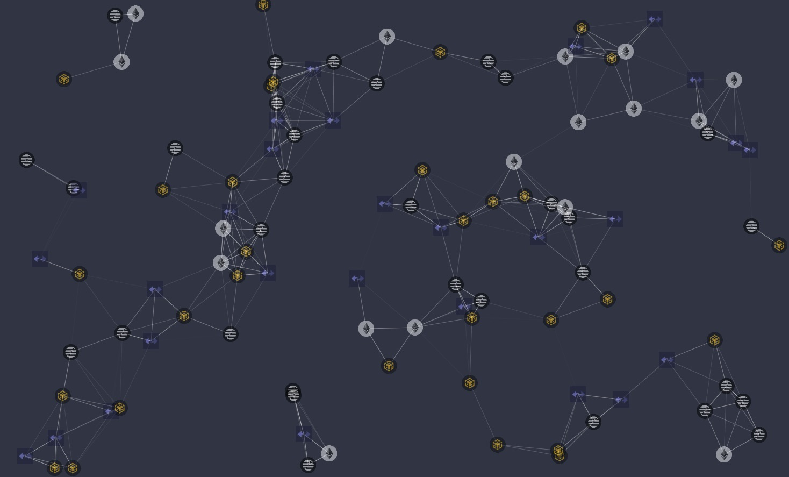

# 粒子效果


使用的库：
1. [tsparticles](https://www.npmjs.com/package/tsparticles)
2. [vue3-particles](https://www.npmjs.com/package/vue3-particles) Vue 对其的封装。

[文档](https://particles.js.org/docs/)。

配置示意：
```js
import ethIcon from '@/assets/icons/chain/eth.png'
import aptosIcon from '@/assets/icons/chain/aptos.png'
import bnbIcon from '@/assets/icons/chain/bnb.png'
import zkIcon from '@/assets/icons/chain/zk2.jpeg'

const imgConfig = {
  width: 150,
  height: 150,
  replaceColor: false,
}

const imgs = [ethIcon, aptosIcon, bnbIcon, zkIcon].map((src) => ({
  src,
  ...imgConfig,
}))

const config = {
  background: {
    color: {
      // value: '#0d47a1',
    },
  },
  fpsLimit: 120,
  // 交互
  // interactivity: {
  //   events: {
  //     onClick: {
  //       enable: true,
  //       mode: 'push',
  //     },
  //     onHover: {
  //       enable: true,
  //       mode: 'repulse',
  //     },
  //     resize: true,
  //   },
  //   modes: {
  //     bubble: {
  //       distance: 400,
  //       duration: 2,
  //       opacity: 0.8,
  //       size: 40,
  //     },
  //     push: {
  //       quantity: 4,
  //     },
  //     repulse: {
  //       distance: 200,
  //       duration: 0.4,
  //     },
  //   },
  // },
  particles: {
    color: {
      value: '#ffffff',
    },
    links: {
      color: '#ffffff',
      distance: 150,
      enable: true,
      opacity: 0.5,
      width: 1,
    },
    // 是否会碰撞
    // collisions: {
    //   enable: true,
    // },
    move: {
      direction: 'none',
      enable: true,
      outMode: 'bounce',
      random: false,
      speed: 1, // 速度为什么会越来越快？
      straight: false,
    },
    number: {
      density: {
        enable: true,
        area: 1000, // 800。值大，越稀疏
      },
      value: 80,
    },
    opacity: {
      value: 0.5,
    },
    shape: {
      // https://particles.js.org/docs/classes/Options_Classes_Particles_Shape_Shape.Shape.html#options
      type: [
        // 'circle',
        'image',
      ],
      options: {
        images: imgs,
      },
    },
    size: {
      // random: true,
      value: 15,
    },
  },
  detectRetina: true,
}

export default config
```

