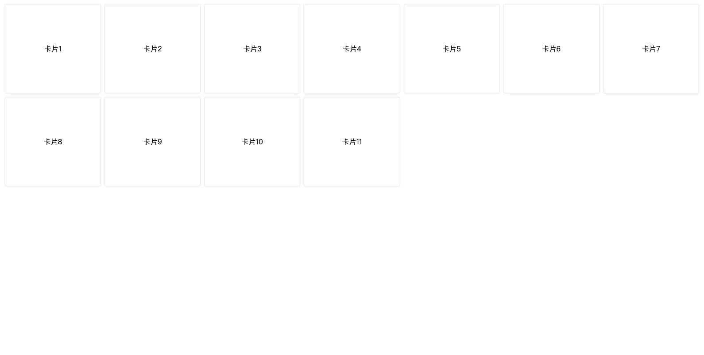

# 自适应卡片布局
实现如下图所示的效果:


其中: 卡片间水平间距是固定的，卡片有最小宽度。

## 实现方案
这个的难点是设置卡片的宽度。

用 Flex 布局，会遇到如下问题:
1. 如果卡片的宽度设置成固定宽度，会出现卡片不能撑满屏幕的情况。
2. 如果卡片的宽度设置成 `flex-grow：1`，会出现最后一行卡片宽度比前几行宽的情况。

我们可以用 js 来算一列的宽度来实现，方案如下。

### 第 1 步：样式设置
用 Flex 布局。核心代码如下：

HTML:
```html
<div class="list">
  <div class="card"></div>
  <div class="card"></div>
  ...
</div>

CSS:
```css
.list {
  display: flex;
  flex-wrap: wrap;
}

.card {
  margin: 0 10px 10px 0;
  flex-grow: 1;
  min-width: 200px;
}
```

### 第 2 步： 计算卡片宽度和可以放几列
可知，一列的宽度为：`(容器宽度 + 卡片右间距) / (卡片最小宽度 + 卡片右间距)` 向下取整。之所以 容器宽度 要加 卡片右间距 的原因是：最后一列的卡片的右间距是 0。

实现代码如下：
```js
function getColumNum(
  wrapElem,
  colMinWidth,
  itemPaddingRight = 10,
  defaultColNum = 5
) {
  if (!wrapElem) {
    return {
      columNum: defaultColNum,
      colWidth: defaultColNum,
    };
  }
  const availableWidth = wrapElem.getBoundingClientRect().width;
  const columNum = Math.floor(
    (availableWidth + itemPaddingRight) / (colMinWidth + itemPaddingRight)
  );
  const colWidth =
    (availableWidth + itemPaddingRight) / columNum - itemPaddingRight;
  return {
    columNum,
    colWidth,
  };
}
```

### 第 3 步： 集成
调用上一步的方法，可以知道列数和卡片宽度。

要将最后一列的右间距设置为 0。
```css
/* 一列时 */
.list-col-1 .card {
  margin-right: 0;
}
/* 两列时 */
.list-col-2 .card:nth-child(2n) {
  margin-right: 0;
}
/* 三列时 */
.list-col-3 .card:nth-child(3n) {
  margin-right: 0;
}
...
```

如果用了 Sass，可以直接遍历生成上面的代码：
```scss
 @for $i from 1 through 20 {
  .list-col-#{$i} {
      .card {
          &:nth-child(#{$i}n) {
              margin-right: 0;
          }
      }
  }
}
```

最后，集成一下。代码如下：
```js
function renderList() {
  const { columNum, colWidth } = getColumNum(listElem, CARD_MIN_WIDTH);
  const res = [];
  for (let i = 0; i < LIST_ITEM_NUM; i++) {
    const itemHTML = `
          <div 
            class="card"
            style="width: ${colWidth}px"
          ">卡片${i + 1}</div>
        `;
    res.push(itemHTML);
  }
  listElem.setAttribute('class', `list list-col-${columNum}`);
  listElem.innerHTML = res.join('');
}
```


