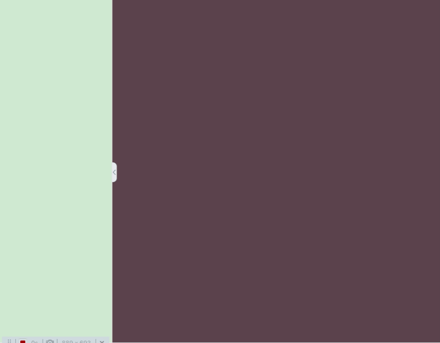
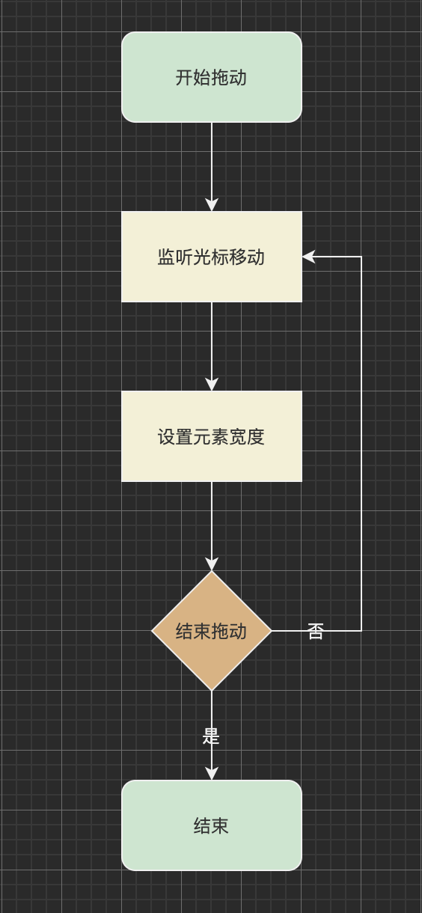

# 实现拖放调整元素宽度的详细介绍
不少管理后台支持拖放来调节左侧菜单的宽度，以此来提升用户体验。



本文会详细介绍下实现。

## 实现算法
实现的算法是：开始拖动分割线，监听光标移动，记录光标的水平位置，设置菜单宽度为当前宽度加上当前光标水平位置与之前水平位置的差值，结束拖动。流程图如下：


下面，我们用 React 来一步步来实现下。

## 具体实现
### 1 开始拖动
在拖动线上，按下鼠标，表示开始拖动。此时，记录光标的水平位置。
```js
// 光标的水平的位置
const [clientX, setClientX] = useState(0)
// 是否在拖动
const [isResizing, setIsResizing] = useState(false)
const handleStartResize = useCallback((e: React.MouseEvent<HTMLElement>) => {
    setClientX(e.clientX)
    setIsResizing(true)
}, [])

return (
  <div
    className={s.resizeHandle}
    onMouseDown={handleStartResize}
  ></div>
)
```

**注意**:为了方便用户开始拖动，可以将拖动线设置的宽一点。如：
```css
.resizeHandle {
  width: 10px;
  cursor: col-resize;
  /* ... */
}
```

### 2 设置菜单的宽度
监听光标移动:
```js
useEffect(() => {
  document.addEventListener('mousemove', handleResize)
  return () => {
    document.removeEventListener('mousemove', handleResize)
  }
}, [handleResize])
```

记录光标的水平位置，设置菜单的宽度：
```js
// 左侧宽度
const [menuWidth, setMenuWidth] = useState(calculatedMenuWidth);
const handleStartResize = useCallback((e) => {
  if(!isResizing) {
    return
  }
  const offset = e.clientX - clientX
  const width = menuWidth + offset
  setMenuWidth(width)
}, [menuWidth, clientX])

return (
  <div className={s.app}>
    <div
      className={s.menu}
      style={{ width: `${menuWidth}px` }}
    >
      菜单
      <div className={s.resizeHandle} />
    </div>
    <div>右侧</div>
  </div>
)
```

拖动时，`mousemove` 事件会被频繁的触发，为了提升性能，我们来做个防抖处理：
```js
import { useDebounceFn } from 'ahooks'
const { run: didHandleResize } = useDebounceFn((e) => {
  /* resize 的业务逻辑 */
}
const handleResize = useCallback(didHandleResize, [...])
```

### 3 结束拖放
抬起鼠标，则结束拖放。
```js
const handleStopResizing = useCallback(() => {
  setIsResizing(false)
}, [prevUserSelectStyle])

useEffect(() => {
  document.addEventListener('mouseup', handleStopResize)
  return () => {
    document.removeEventListener('mouseup', handleStopResize)
  }
}, [handleStopResize])
```

以上实现了核心功能，但在生产环境中使用，需要更好的的用户体验。下面我们来做些优化。

## 优化
### 限制菜单的宽度
菜单太宽或太窄，都会导致显示的效果不好。因此，要设置限制菜单的最大，最小宽度。
```js
const MENU_MIN = 200;
const MENU_MAX = 600;

const handleResize = useCallback(offset => {
  let res = menuWidth + offset;
  if (res < MENU_MIN) {
    res = MENU_MIN;
  }
  if (res > MENU_MAX) {
    res = MENU_MAX;
  }
  setMenuWidth(res);
}, [menuWidth]);
```

### 存储设置的菜单宽度
用户设置了菜单宽度后，页面刷新，需要仍然是之前的菜单宽度。
```js
const MENU_DEFAULT = 300

const [menuWidth, setMenuWidth] = useState(localStorage.getItem('app-left-menu-width') || MENU_DEFAULT)

const handleResize = useCallback(offset => {
  const res = ...
  setMenuWidth(res)
  localStorage.setItem('app-left-menu-width', `${res}`);
}, [])

```


### 优化结束拖动的判断
如果用户在抬起鼠标时，在 iframe 中或该元素禁止了 `mouseup` 的冒泡，导致该事件不会冒泡到 `document` 上，导致判断结束拖动的失效。

解决方案：拖动时，在页面上盖一个遮罩，盖住下面的元素。用户 `mouseup` 时，其实是在遮罩元素上，总会冒泡到 `document` 上。JS:
```js
{isResizing && <div className={s.mask} />}
```

CSS:
```css
.mask {
  position: fixed;
  z-index: 98;
  left: 0;
  top: 0;
  height: 100%;
  width: 100%;
}
```

### 去除拖动时对文字的选中
拖动时，经过文字时，会选中文字。下面的代码来去除选中:
```js
const [prevUserSelectStyle, setPrevUserSelectStyle] = useState(getComputedStyle(document.body).userSelect)

const handleStartResize = useCallback((e: React.MouseEvent<HTMLElement>) => {
  setPrevUserSelectStyle(getComputedStyle(document.body).userSelect)
  document.body.style.userSelect = 'none'
  //...
}, [...])

const handleStopResize = useCallback(() => {
  document.body.style.userSelect = prevUserSelectStyle
  // ...
}, [...])
```

## 完整代码
我将调整元素宽度的功能抽象成了一个组件。组件的调用代码如下：
```js
import {useState, useCallback} from 'react'
import ResizeWidth from './components/resize-width/index.tsx'
import s from './App.module.scss';

const MENU_MIN = 200
const MENU_MAX = 600
const MENU_DEFAULT = 300
function App() {
  const storedMenuWidth = localStorage.getItem('app-left-menu-width')
  const calculatedMenuWidth = storedMenuWidth ? parseInt(storedMenuWidth, 10) : MENU_DEFAULT
  const [menuWidth, setMenuWidth] = useState(calculatedMenuWidth)
  const [expandLeftWidth, setExpandLeftWidth] = useState(calculatedMenuWidth)
 
  const handleResize = useCallback(offset => {
    let res = menuWidth + offset
    if (res < MENU_MIN) {
      res = MENU_MIN
    }
    if (res > MENU_MAX) {
      res = MENU_MAX
    }
    setMenuWidth(res)
    setExpandLeftWidth(res)
    localStorage.setItem('app-left-menu-width', `${res}`)
  }, [menuWidth])

  const handleToggleExpand = useCallback((isExpend) => {
    setMenuWidth(isExpend ? expandLeftWidth : 0)
  }, [expandLeftWidth])

  return (
    <div
      className={s.app}
    >
      <div
        className={s.menu}
        style={{ width: `${menuWidth}px` }}
      >
        <ResizeWidth
          onResize={handleResize}
          onToggleExpand={handleToggleExpand}
        />
      </div>
      <div className={s.main}>
      </div>
    </div>
  )
}

export default App
```

组件代码如下：
```js
import React, { FC, useCallback, useEffect, useState } from 'react'
import { useDebounceFn } from 'ahooks'
import cn from 'classnames'
import s from './style.module.scss'

export interface IResizeWidthProps {
  onResize: (offset: number) => void
  onToggleExpand: (isExpand: boolean) => void
}

const ResizeWidth: FC<IResizeWidthProps> = ({
  onToggleExpand,
  onResize
}) => {
  const [clientX, setClientX] = useState(0)
  const [isResizing, setIsResizing] = useState(false)
  const [prevUserSelectStyle, setPrevUserSelectStyle] = useState(getComputedStyle(document.body).userSelect)

  const handleStartResize = useCallback((e: React.MouseEvent<HTMLElement>) => {
    setClientX(e.clientX)
    setIsResizing(true)
    setPrevUserSelectStyle(getComputedStyle(document.body).userSelect)
    document.body.style.userSelect = 'none'
  }, [])

  const handleStopResize = useCallback(() => {
    setIsResizing(false)
    document.body.style.userSelect = prevUserSelectStyle
  }, [prevUserSelectStyle])

  const { run: didHandleResize } = useDebounceFn((e) => {
    if(!isResizing) {
      return
    }
    const offset = e.clientX - clientX
    setClientX(e.clientX)
    onResize(offset)
  }, {
    wait: 0,
  })

  const handleResize = useCallback(didHandleResize, [isResizing, clientX, didHandleResize])

  useEffect(() => {
    document.addEventListener('mouseup', handleStopResize)
    document.addEventListener('mousemove', handleResize)
    return () => {
      document.removeEventListener('mouseup', handleStopResize)
      document.removeEventListener('mousemove', handleResize)
    }
  }, [handleStopResize, handleResize])


  const [isExpand, setIsExpand] = useState(true)
  const handleToggleExpand = () => {
    const next = !isExpand
    onToggleExpand(next)
    setIsExpand(next)
  }

  return (
    <div
      className={s.resizeHandle}
      onMouseDown={handleStartResize}
    >
      <div className={cn(s.toggleBtn, !isExpand && s.fold)} onClick={handleToggleExpand} />
      {isResizing && <div className={s.mask} />}
    </div>
  )
}
export default React.memo(ResizeWidth)
```

关注公众号: 前端GoGoGo，助你升职加薪~